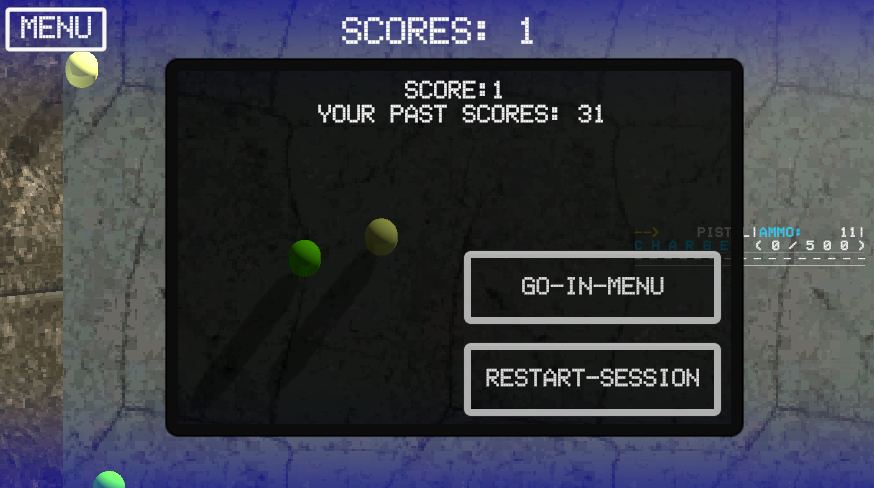

## Example-Top-Down-Shooter.

**Описание:**

Цель данного тестового задания - создание Top Down шутера, в котором игрок управляет персонажем, может передвигаться по карте, отстреливаясь от противников, используя различное оружие, подбирая бонусы. 
Цель игры - набрать как можно больше очков до смерти.
Между игровыми сессиями должно сохранятся значение рекорда.
Баланс данного геймплея не имеет значения.

**Игровые сцены**

Должно быть две игровых сцены:
* сцена меню;
* игровая сцена.
  
**Главное меню**

На главном экране расположены:
* кнопка “старт", которая запускает игровую сцену;
* максимально набранное игроком количество очков.

**Игровая сцена**

Вид сверху.
В верхнем левом углу должна быть кнопка выхода в главное меню.
Сверху по центру должно отображаться количество набранных в текущую игровую сессию очков.

**Игрок**

Игрок изначально располагается по центру карты.
Игрок может ходить.
Игрок может стрелять.
При стрельбе игрок разворачивается в направлении стрельбы не моментально, а с некоторой угловой скоростью, в ближайшую сторону.

**Управление:**

передвижение: стрелочки на клавиатуре;
стрельба: левая кнопка мыши.
Параметры игрока:
скорость движения: 4 unit в секунду;
скорость поворота: 180 градусов в секунду.
Игрок может подбирать разные бонусы, которые дают ему оружие или временные усиления.
