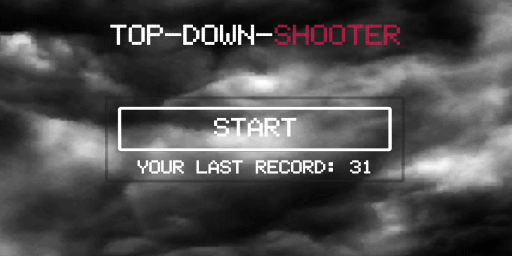
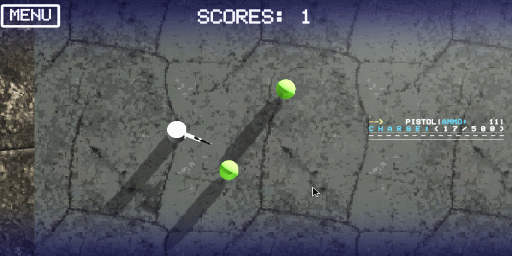

## :dvd: example-top-down-shooter :dvd:


<details><summary>:page_with_curl: Description:</summary>

>  </br>
> The purpose of this test task is to create a Top Down shooter in which the player controls a character and can move around the map, shooting at enemies, using various weapons, and picking up bonuses. </br>
> The goal of the game is to score as many points as possible before dying. </br>
> The high score value should be saved between game sessions. </br>
> The balance of this gameplay does not matter. </br>
</details>

<details><summary>:page_with_curl: Game scenes:</summary>
  
> There should be two game scenes:
> * menu scene; </br>
> * game scene.
</details>

<details><summary>:page_with_curl: Main menu:</summary>
  
>  </br>
> On the main screen there are: </br>
> * “start” button, which launches the game scene; </br>
> * the maximum number of points scored by the player. </br>

</details>

<details><summary>:page_with_curl: Game scene:</summary>
  
>  </br>
> Top view. </br>
> In the upper left corner there should be a button to exit to the main menu. </br>
> The number of points scored in the current gaming session should be displayed at the top center. </br>
</details>

<details><summary>:page_with_curl: Player:</summary>
  
> The player is initially positioned in the center of the map. </br>
> The player can walk. </br>
>The player can shoot. </br>
> When shooting, the player turns in the direction of shooting not instantly, but with a certain angular velocity, in the nearest direction. </br>

</details>

<details><summary>:page_with_curl: Controls:</summary>
  
> ### Management </br>
> movement: ```WASD```; </br>
> shooting: ```Left mouse button | Right mouse button```. </br>
> ### Player options: </br>
> movement speed: 4 units per second; </br>
> Turning speed: 180 degrees per second. </br>
> The player can pick up different bonuses that give him weapons or temporary enhancements. </br>
</details>
