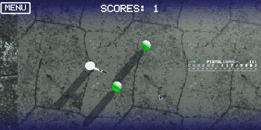

## example-top-down-shooter

<details><summary>Описание:</summary>

>  </br>
> Цель данного тестового задания - создание Top Down шутера, в котором игрок управляет персонажем, может передвигаться по карте, отстреливаясь от противников, используя различное оружие, подбирая бонусы. </br> 
> Цель игры - набрать как можно больше очков до смерти. </br>
> Между игровыми сессиями должно сохранятся значение рекорда. </br>
> Баланс данного геймплея не имеет значения. </br>
</details>

<details><summary>Игровые сцены</summary>
  
> Должно быть две игровых сцены:
> * сцена меню;
> * игровая сцена.
</details>

<details><summary>Главное меню</summary>
  
>  </br>
> На главном экране расположены: </br>
> * кнопка “старт", которая запускает игровую сцену; </br>
> * максимально набранное игроком количество очков. </br>

</details>

<details><summary>Игровая сцена</summary>
  
>  </br>
> Вид сверху. </br>
> В верхнем левом углу должна быть кнопка выхода в главное меню. </br>
> Сверху по центру должно отображаться количество набранных в текущую игровую сессию очков. </br>
</details>

<details><summary>Игрок</summary>
  
> Игрок изначально располагается по центру карты. </br>
> Игрок может ходить. </br>
>Игрок может стрелять. </br>
> При стрельбе игрок разворачивается в направлении стрельбы не моментально, а с некоторой угловой скоростью, в ближайшую сторону. </br>

</details>

<details><summary>Управление:</summary>
  
> ### Управление </br>
> передвижение: ```WASD```; </br>
> стрельба: ```Left mouse button | Right mouse button```. </br>
> ### Параметры игрока: </br>
> скорость движения: 4 unit в секунду; </br>
> скорость поворота: 180 градусов в секунду. </br>
> Игрок может подбирать разные бонусы, которые дают ему оружие или временные усиления. </br>
</details>


